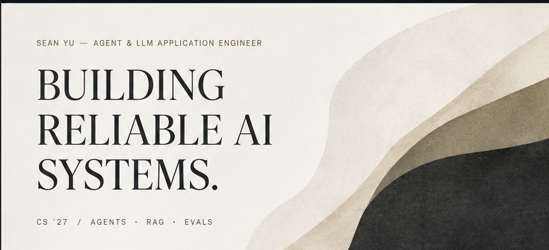
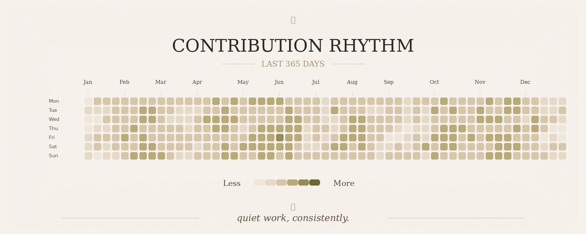

  

  ✦ &nbsp; OBSERVE &nbsp; / &nbsp; REASON &nbsp; / &nbsp; ACT &nbsp; / &nbsp; IMPROVE &nbsp; ✦

 

## Selected Engineering

<table>
<tr>
<td width="50%" valign="top">

### MergeWarden
AI PR REVIEW AGENT

AI-powered advisory PR reviewer for finding behavioral regressions, engineering risks, test gaps, and other issues that conventional CI can miss.

`Python` · `FastAPI` · `GitHub Actions` · `Structured Evidence` · `Evaluation`

[View repository ↗](https://github.com/takagibit18/MergeWarden)

</td>
<td width="50%" valign="top">

### ShotgunCV
AI RESUME OPS

Pipeline-first AI Resume Ops system that turns multiple job descriptions into analyzed roles, resume variants, scoring, ranking, and application strategy.

`Python` · `CLI` · `Structured Output` · `OCR / Vision` · `Evaluation`

[View repository ↗](https://github.com/takagibit18/shotgunCV)

</td>
</tr>
</table>

 

## Contribution Rhythm

  

 

## Retrieval Evaluation

> **Evaluation before architecture.**  
> In the current retrieval benchmark, the BM25 baseline outperformed the tested hybrid and vector alternatives.

<table>
<tr>
<td align="center" width="25%"><strong>0.913</strong> MRR</td>
<td align="center" width="25%"><strong>0.840</strong> P@1</td>
<td align="center" width="25%"><strong>0.940</strong> R@10</td>
<td align="center" width="25%"><strong>0.950</strong> Weighted R@10</td>
</tr>
</table>

BM25 · Hybrid Retrieval · Vector Retrieval · Reranking · Golden Evaluation

 

## Experience

**AI Application Development Intern**  
National Data Group · on-site via Aspire · 2026

Worked on enterprise AI application delivery, agent/RAG evaluation, platform testing, and lightweight reference implementations for practical conversational AI workflows.

 

## Capabilities

<table>
<tr>
<td width="33%" valign="top">

**Agent Systems**

Tool calling, structured outputs, controllable agent loops, context engineering, tool boundaries, and failure handling.

</td>
<td width="33%" valign="top">

**RAG & Evaluation**

BM25, hybrid retrieval, reranking, grounding, golden sets, failure analysis, and evaluation-driven iteration.

</td>
<td width="33%" valign="top">

**AI Backend**

Python, FastAPI, Pydantic, asyncio, Docker, testing, structured logging, and API orchestration.

</td>
</tr>
</table>

 

## Now

Currently improving **MergeWarden**, with a focus on graph-mode evaluation, evidence recall, and PR-review reliability.

 

  BUILD · EVALUATE · ITERATE

